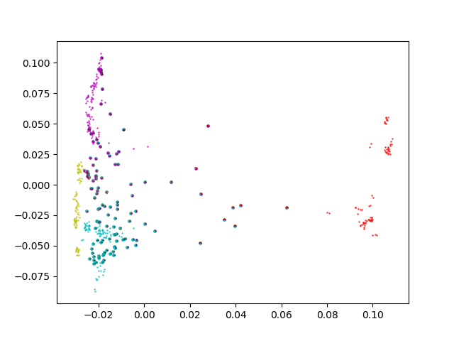

# PopulaPy
Python (numpy/scipy/pandas/matplotlib) based Visualization tool for population structure data as generated with Illumina SNP chips. 

## plotPCA
Various versions to plot PCA (as calculated by plink --pca) together with ADMIXTURE information: every point is a piechart.
plotPCA3 also contains a (repeated) subsampling procedure, as well as exclusion of populations that are less relevant.

Dependencies:
* plink output files
* pandas
* matplotlib
* python 3

The Python scripts are supposed to be used as examplary.

